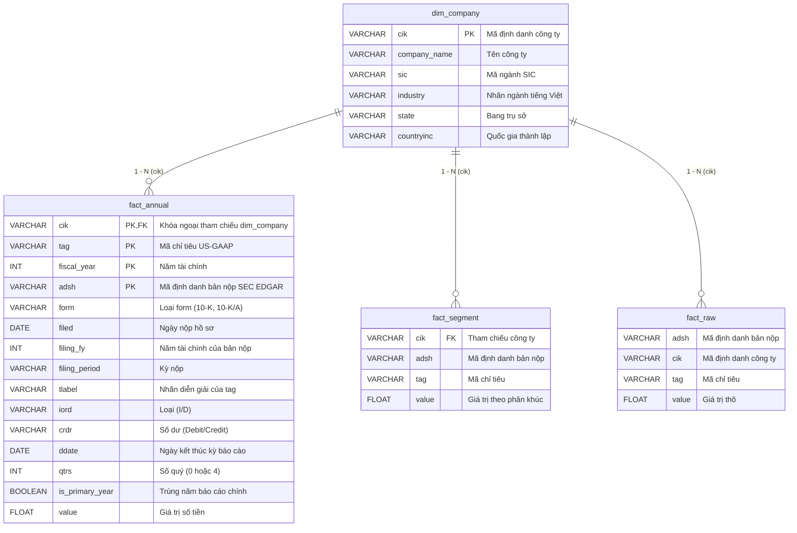

```mermaid
erDiagram
    dim_company {
        VARCHAR cik PK "Mã định danh công ty"
        VARCHAR company_name "Tên công ty"
        VARCHAR sic "Mã ngành SIC"
        VARCHAR industry "Nhãn ngành tiếng Việt"
        VARCHAR state "Bang trụ sở"
        VARCHAR countryinc "Quốc gia thành lập"
    }

    fact_annual {
        VARCHAR cik PK,FK "Khóa ngoại tham chiếu dim_company"
        VARCHAR tag PK "Mã chỉ tiêu US-GAAP"
        INT fiscal_year PK "Năm tài chính"
        VARCHAR adsh PK "Mã định danh bản nộp SEC EDGAR"
        VARCHAR form "Loại form (10-K, 10-K/A)"
        DATE filed "Ngày nộp hồ sơ"
        INT filing_fy "Năm tài chính của bản nộp"
        VARCHAR filing_period "Kỳ nộp"
        VARCHAR tlabel "Nhãn diễn giải của tag"
        VARCHAR iord "Loại (I/D)"
        VARCHAR crdr "Số dư (Debit/Credit)"
        DATE ddate "Ngày kết thúc kỳ báo cáo"
        INT qtrs "Số quý (0 hoặc 4)"
        BOOLEAN is_primary_year "Trùng năm báo cáo chính"
        FLOAT value "Giá trị số tiền"
    }

    fact_segment {
        VARCHAR cik FK "Tham chiếu công ty"
        VARCHAR adsh "Mã định danh bản nộp"
        VARCHAR tag "Mã chỉ tiêu"
        FLOAT value "Giá trị theo phân khúc"
    }

    fact_raw {
        VARCHAR adsh "Mã định danh bản nộp"
        VARCHAR cik "Mã định danh công ty"
        VARCHAR tag "Mã chỉ tiêu"
        FLOAT value "Giá trị thô"
    }

    dim_company ||--o{ fact_annual : "1 - N (cik)"
    dim_company ||--o{ fact_segment : "1 - N (cik)"
    dim_company ||--o{ fact_raw : "1 - N (cik)"
```